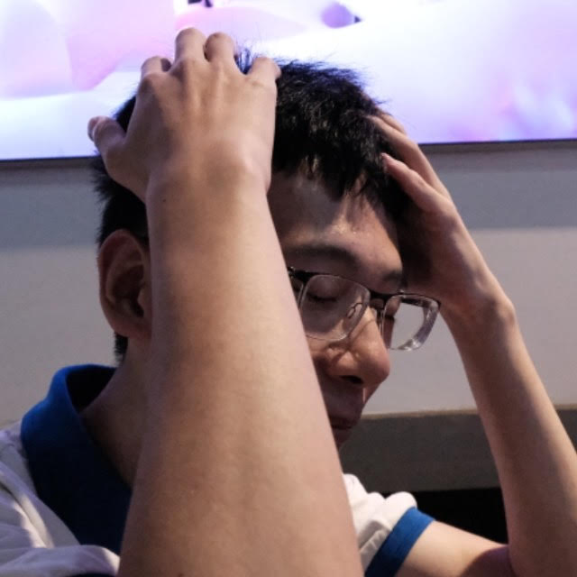

## About Me

Hi, I'm Jinlin Wu. I have got my bachelor's degree from University of Electronic Science and Technology of China in 2023. I studied intergrated circuit&system there and mainly focus on digital circuit.

I'm gonna join [CARAS Lab](https://titech-caras.github.io/), Department of Information and Communications Engineering, Tokyo Institute of Technology as a master student on Sep. 2023. 

## Research Interest

I have some experience on FPGA and SoC design. Interest in hardware designing lead my continuous learning and exploration in hardware architecture. So my future research field in Tokyo Tech will be **computer architecture**.

## Publications

Non currently. Hope this guy can be creative later.

---

> Thank you for visiting my website. You can find my CV (PDF) and contact me in the upper right corner.

